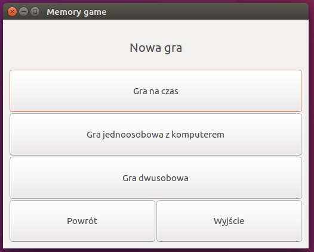

# The Memory Game
This game was created for my C language classes project. It's a simple memory game, which can be played in few game modes: two-player or single-player (against the time or a computer). The game uses a text file saving method. It was written using the GTK library. The player can save his current play and finish it later. In the menu one man find a records table (best times on a specific size of the board).

## Running the game
To compile the program the GTK+-3.0 library should be installed. 

On Linux it can be installed by typing in the terminal the following line:

`sudo apt-get install gtk+-3.0`

After installing the library, we can compile the program using the following command:

`make game`

To run the game, we just need to type:

`./game`

We can also clean an executable file with a command:

`make clean`

## Controls

The game is mouse only controlled.

## Language
Unfortunately, the game is currently available only in Polish.

## Screenshots

 

*New Game Window*

 

*New Game Menu Window*

 

*Continue Game Menu Window*

 

*Choice Menu Window*

 

*New Game Window*

 

*Memory Game 1*

 

*Memory Game 2*

 

*Game Over*

